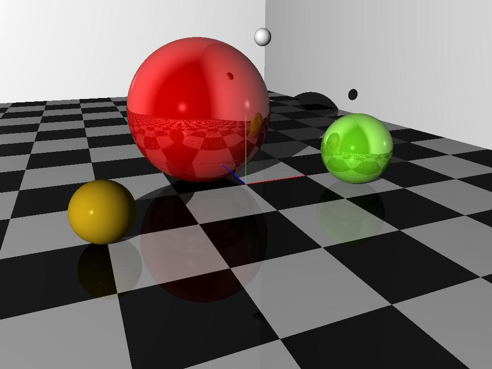

# rt
Go implementation of The Ray Tracer challenge

### Description
This is my WiP implementation of the Ray tracer as described in the book "The Ray Tracer Challenge" by https://pragprog.com/book/jbtracer/the-ray-tracer-challenge

The code is highly unperformant and unoptimized.

### License 
MIT, see LICENSE.md
