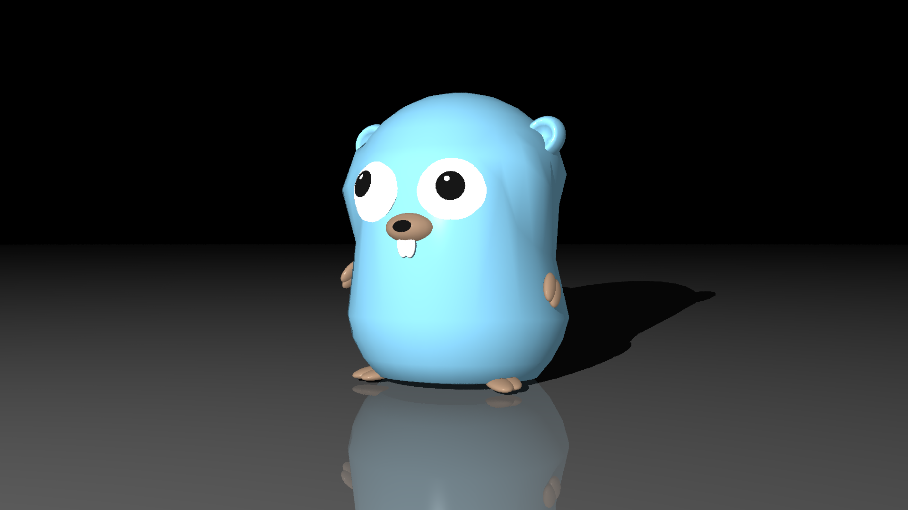
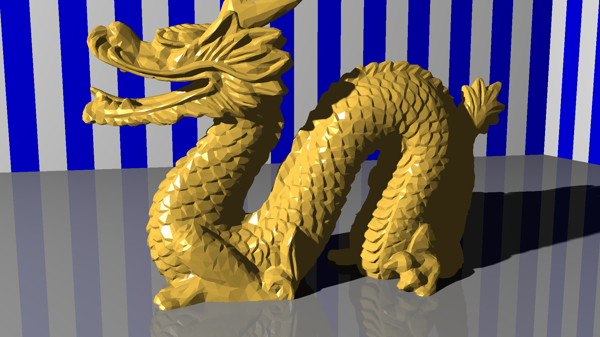
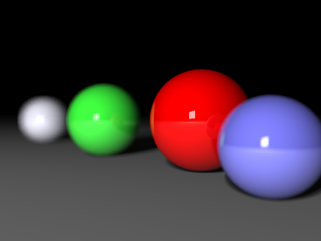

# rt
My Golang implementation of [The Ray Tracer challenge](https://pragprog.com/book/jbtracer/the-ray-tracer-challenge) book by Jamis Buck.

_The Golang gopher, 3D model by [Takuya Ueda](https://twitter.com/tenntenn), Go Gopher by [Renee French](http://reneefrench.blogspot.com/)._

_(multisampling and soft shadows)_

_(the good ol' dragon, soft shadows. Note that the dragon model uses surface rather than vertex normals)_

_(depth of field)_

### Description
This is my WiP implementation of the Ray tracer as described in the book "The Ray Tracer Challenge" by https://pragprog.com/book/jbtracer/the-ray-tracer-challenge plus a few extras.

### Changelog (and performance fixes)
Just to keep track of which fixes were done when, kind of...

- 2020-03-19: Pass pointers to arrays for certain method calls 
- 2020-03-16: Assembler impl of vector * matrix multiplication through [c2goasm](https://github.com/minio/c2goasm)
- 2020-03-06: .MTL materials hack
- 2020-02-29: Depth of field
- 2020-02-25: Soft shadows and multisamling
- 2020-02-23: BVH
- 2020-02-21: Bounding boxes for groups and CSGs (based on bonus chapter from book)
- 2020-02-20: Refactor to use arrays instead of slices for Matrices and Tuples.
- 2020-02-19: Use sort.Sort instead of sort.Slice
- 2020-02-15: Soft shadows and multisamling (feature-branch)
- 2020-02-05: Pass job per line instead of pixel
- 2020-01-10: Reduce allocations, cache stuff in render contexts
- 2019-12-28: Cache inverse
- 2019-12-25: Multi-threading

### Features, State etc
I think I've got all the features from the book covered, including:

- Depth of Field
- Soft shadows with Area Lights
- Bounding boxes / BVH
- Spheres, Cubes, Cones, Cylinders, Planes, Triangles, CSGs
- Phong shading etc
- Multiple light sources
- Shadows, Reflection, Refraction, CSGs
- Groups
- Triangle render and .obj/.mtl loading 

There's some unfinished / WiP stuff such as a YAML loader _NOT_ compatible with the .yaml format used in the book!

While all test cases from the books should be implemented, they may at times point at old (unused) implementations of certain features that I havn't gotten around to fix yet.

### Performance
Quite naive implementation, has some basic caching of Inverse matrices, multi-threading using worker pool and some various measures to avoid allocating memory. Still loads of stuff to do since the allocation-heavy parts of the code really seems to kill performance. Nevertheless, the optimizations I've done since start resulted a reference render going from 3m14s (single threaded) to 0.8 seconds (8 threads).

Things left to try:
- Pre-compute triangle normals from .OBJ models
- Eliminate allocations
- Optimize AABB intersections

### License 
MIT, see LICENSE.md
